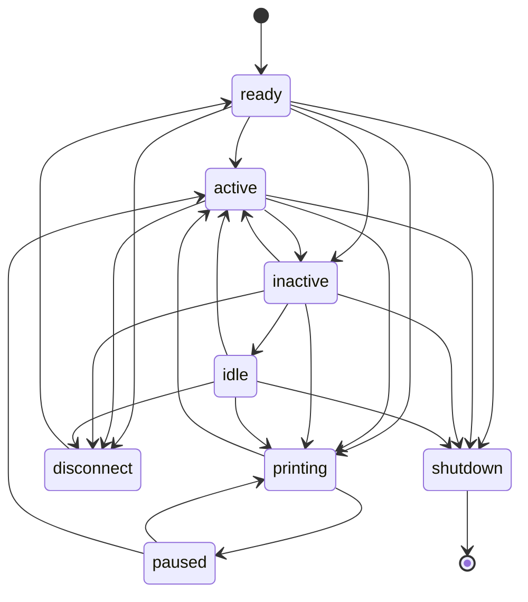

# voron-klipper-extensions
A set of Klipper extensions designed to improve operation of Voron printers.

## Available Extensions
### Settling Probe
For some currently unknown reason, Voron printers seem to suffer from an issue
where the first probing sample is off by some margin. Subsequent samples are
much closer (or the same) to each other. The current theory is that there is
some toolhead/axis settling on the first sample.

In order to avoid polluting the probe samples, the first sample should be
thrown away.

This extension adds support for performing a single, throw-away, settling
probe sample that is not part of the sample set used for calculating Z
positions.

The extension replaces the default `probe` Klipper object with the modified
one in order to allow all commands/operations that perform Z probing to
benefit from this.

To enable the module, add the following to your `printer.cfg` file right after
the `[probe]` section:

```ini
[settling_probe]
#settling_sample:
#   Globally enable the throw-away settling sample. Default is 'False'.
#   Setting this to 'True' will enable the throw-away sample for all
#   commands/operations that perform Z probing (QGL, Z tilt, Bed Mesh,
#   Screw Tilt, etc.)
```

The module also augments the `PROBE`, `PROBE_ACCURACY`, and `PROBE_CALIBRATE`
commands with an extra parameter - `SETTLING_SAMPLE` - which can be used to
control whether the commands perform a settling sample independently from the
`settling_sample` setting.

### GCode Shell Command
The original extension is part of the Kiauh repo
(https://github.com/th33xitus/kiauh/blob/master/resources/gcode_shell_command.py).
I've modified it to add support for custom GCode execution on either success
or failure:

#### Usage
```ini
[gcode_shell_command COMMAND]
#value_<var>: <value>
#   Output value that can be updated by the command. <value>
#   serves as a default.
command:
#   The command line to be executed. This option is required.
#   The command can update the values for any of the value_*
#   variables above. In order to do so, the command should
#   output the update value in the following format:
#      VALUE_UPDATE:<var>=<value>
#   Only one value can be updated on a single line. The updated
#   values are processes as strings.
#timeout: 2.0
#   The amount of time (in seconds) to wait before forcefully
#   terminating the command.
#verbose: True
#   Enable verbose output to the console.
#success:
#   A list of G-Code commands to execute if the command
#   completes successfully. If this option is not present
#   nothing will be executed.
#   This section is evaluated as a template and can
#   reference the value_* values.
#failure:
#   A list of G-Code commands to execute if the command
#   does not complete successfully. If this option is not
#   present nothing will be executed.
#   This section is evaluated as a template and can
#   reference the value_* values.
```
#### Examples
```ini
[gcode_shell_command my_command]
command: echo my_command executing
success:
    M117 my_command executed successfully.
failure:
    M117 my_command failed.

[gcode_macro exec_my_command]
gcode:
    RUN_SHELL_COMMAND CMD=my_command
```

```ini
[gcode_shell_command my_command]
value_var1: 0
command: echo "VALUE_UPDATE:var1=10"
success:
    {action_respnd_info("var1=%s" % var1)}
```

> **Warning** **Infinite Loops**
>
> Since the G-Code executed on success/failure can be arbitrary, on top of
> all the other issues resulting from using external commands, it is now
> possible to create an infinite loop that will prevent the printer from
> continuing.
>
> For example, the following will cause an infinite loop:
>
> ```ini
> [gcode_shell_command my_command]
> command: echo my_command executing
> success:
>     exec_my_command
> 
> [gcode_macro exec_my_command]
> gcode:
>     RUN_SHELL_COMMAND CMD=my_command
> ```

### LED Interpolation
A small extension that can be used to smootly transition (interpolate) RGB(W)
LEDs between colors.

While planning/working on adding LEDs to my printer case, I wanted to be able
to have the LEDs dim. However, rather than just setting the color and have the
dimming happen immediately, I thought it will be much nicer if they transition
smoothly.

The led_interpolate.py extension does that. It will smoothly transition a set
of LEDs from their current color/brightness to a given color/brightness.

#### Setup

After installing the extention, add the following to your config file to enable
the `LED_INTERPOLATE` command:

```ini
[led_interpolate]
```

#### Usage

```gcode
LED_INTERPOLATE LED=<config_name> RED=<value> GREEN=<value> BLUE=<value> [WHITE=<value>] [FACTOR=<value>]
```

The command will transition the LED `<config_name>` to the values specified by
`RED`, `GREEN`, `BLUE`, and `WHITE`. `WHITE` is optional and valid only for RGBW
LEDs. If the LEDs are chained, the entire chain will be transitioned. `FACTOR`
can be used to alter the amount by which each step in the transition will change
 the current color.

#### Known Issues

* The algorithm is not perfect when it comes to interpolating a chain of LEDs
  which have different starting values. It does its best to get all LEDs in the
  chain to arrive at the desired color at the same time but it's not perfect.
* While the extension manipulates the LEDs Klipper objects directly, bypassing
  any GCode, it may still interfere with normal command processing if the LEDs
  are connected to the MCU controlling the printing operations.

### Printer State Notifications
Klipper's `idle_timeout` module define a set of printer states that change based
what the printer is currently doing. Those states are `ready`, `printing`, and
`idle`.

While those states are available to macros, the module does not provide a way to
execute custom GCode when the printer transition states (with the exception of
the `idle` state).

This extension can be used for this purpose. It provides a new set of states that
are richer than the ones defined by Klipper. In addition, it allows for the
execution of custom GCode for each one of the states.

#### Motivation
I set about creating this module for two main reasons:
1. I had some macros that I wanted to be executed when the printer "boots" up.
The normal way to do that was to define a `[delayed_gcode]` macro with an
`initial_duration` set to 1 second. However, that felt clumsy and not very clean.
2. I wanted to be able to turn off the LCD after a period of no activity. While
that was easy to do, turning it back on was much more challenging. I tried tieing
a `[gcode_button]` to the LCD button but due to a "bug" in Klipper, doing so led
to Klipper crashes.
3. My other attempt at this required modification to the default `idle_timeout.py`
module. While that worked it caused the Klipper repository on the Pi to be "dirty",
which meant that I had to do manual work to update Klipper.

#### Module States and Transition
The module defines the following states:

| State | Description |
| :- | -- |
| `ready` | The `ready` state is entered when the printer has initialized and ready. |
| `active` | The `active` state is entered when the printer is actively executing commands. |
| `printing` | The printer is printing. |
| `paused` | The current print is paused. |
| `inactive` | The `inactive` state is entered after a period of time with no activity. |
| `idle` | The `idle` state is entered after the timeout in `idle_timeout` has elapsed. |
| `shutdown` | The printer been shutdown. This can happen due to an error or through a user command. |
| `disconnect` | Klipper has been disconnected from the MCU. |

The states can transition in the following manner:



The Gcode templates are executed as follows:

| New State | Previous State(s) | Gcode Template |
| -- | -- | -- |
| `ready` | `Node`, `disconnect` | The `on_ready_gcode` template is executed. The printer should enter this state only on initial startup. So this template will be executed only once.|
| `active` | `ready`, `inactive`, `idle` | The `on_active_gcode` template is executed. |
| `printing` | `inactive`, `idle` | The `on_active_gcode` template is executed. Transitioning from the `inactive` or `idle` states to the `printing` state implies an `active` transition. |
| `inactive` | `ready`, `active`, `printing` | The `on_inactive_gcode` template is executed. |
| `idle` | `inactive` | The `on_idle_gcode` is executed. Note that the `idle_timeout` module also can execute custom gcode through the `idle_timeout::gcode` setting. |

#### Usage
The module is activated by adding the `[state_notify]` section to the printer's
configuration. The section has the following options/configuration:

```ini
[state_notify]
#inactive_timeout:
#     Duration (in seconds) of no activity before the printer enters the `inactive`
#     state.
#on_ready_gcode:
#     GCode template that will be executed when the printer is done initializing
#     and is ready.
#on_active_gcode:
#     GCode template executed when the printer becomes active. This state switch
#     is usually triggered by the execution of other GCode commands or usage of
#     the display menu.
#on_inactive_gcode:
#     GCode template executed when the `inactive_timeout` duration elapses. The
#     timer starts after the completion of any previous activity. This includes
#     any GCode commands or interaction with the display menu.
#on_idle_gcode:
#     GCode template executed when the `idle_timeout` timeout duration elapses.
#     This GCode is executed in addition to the `idle_timeout::gcode` template.
```

> **Note**
>
> The way Klipper detects that there is some activity is by monitoring the
> estimated print time through the `toolhead` object. Effectively, Klipper has
> to start executing GCode in order for the any module to be able to detect
> activity.
>
> Therefore, it is not possible to switch to the `active` state prior to Klipper
> executing any GCode. As a result, the `on_active_gcode` template is executed
> after the command that triggered the state change. If that command is a long
> macro, it is possible that the `on_active_gcode` template will execute much
> later than the initial activity has started.

The module provides a new command - `STATE_NOTIFY_STATE` - that will display the
current state.

The current state can also be queried in macros by using the `printer.state_notify`
object:

```gcode
[gcode_macro STATE_NOTIFY_EXAMPLE]
description: Display the state_notify state
gcode:
    
    {action_respond_info("state_notify: state=%s, timeout=%" % (st.state, st.timeout))}
```

## Installation
1. Login to your RaspberryPi.
2. Clone this repository:
```sh
git clone https://github.com/voidtrance/voron-klipper-extensions.git
```
3. Change directory to the new cloned repository:
```sh
cd voron-klipper-extensions
```
4. Run the install script:
```sh
./install-extensions.sh
```
5. Add the following section to `moonraker.conf`:
```ini
[update_manager voron-klipper-extensions]
type: git_repo
path: ~/voron-klipper-extensions
origin: https://github.com/voidtrance/voron-klipper-extensions.git
install_script: install-extensions.sh
managed_services: klipper
```

## Contributing
If you'd like to contribute, please submit a pull request with your suggested
changes. When submitting changes, please follow the [coding style](coding-style.md).
