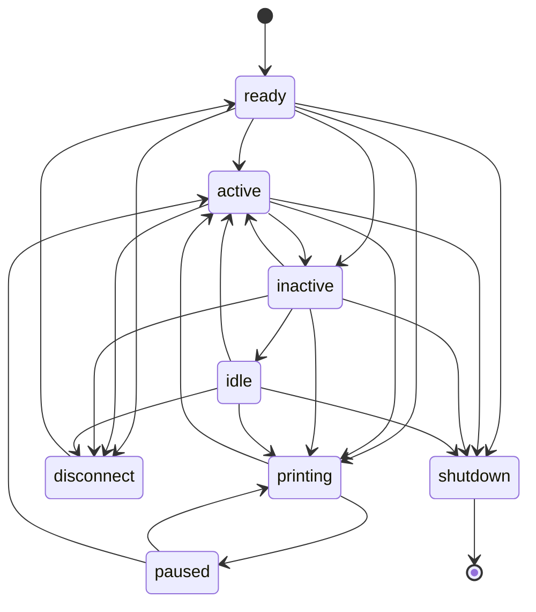

# Printer State Notifications
Klipper's `idle_timeout` module define a set of printer states that change based
what the printer is currently doing. Those states are `ready`, `printing`, and
`idle`.

While those states are available to macros, the module does not provide a way to
execute custom GCode when the printer transition states (with the exception of
the `idle` state).

This extension can be used for this purpose. It provides a new set of states that
are richer than the ones defined by Klipper. In addition, it allows for the
execution of custom GCode for each one of the states.

## Motivation
I set about creating this module for two main reasons:
1. I had some macros that I wanted to be executed when the printer "boots" up.
The normal way to do that was to define a `[delayed_gcode]` macro with an
`initial_duration` set to 1 second. However, that felt clumsy and not very clean.
2. I wanted to be able to turn off the LCD after a period of no activity. While
that was easy to do, turning it back on was much more challenging. I tried tieing
a `[gcode_button]` to the LCD button but due to a "bug" in Klipper, doing so led
to Klipper crashes.
3. My other attempt at this required modification to the default `idle_timeout.py`
module. While that worked it caused the Klipper repository on the Pi to be "dirty",
which meant that I had to do manual work to update Klipper.

## Module States and Transition
The module defines the following states:

| State | Description |
| :- | -- |
| `ready` | The `ready` state is entered when the printer has initialized and ready. |
| `active` | The `active` state is entered when the printer is actively executing commands. The printer is also considered active if there are any active heaters (heaters with a target >= 0.0 degrees). |
| `printing` | The printer is printing. |
| `paused` | The current print is paused. |
| `inactive` | The `inactive` state is entered after a period of time with no activity. |
| `idle` | The `idle` state is entered after the timeout in `idle_timeout` has elapsed. |
| `shutdown` | The printer been shutdown. This can happen due to an error or through a user command. |
| `disconnect` | Klipper has been disconnected from the MCU. |

The states can transition in the following manner:



The Gcode templates are executed as follows:

| New State | Previous State(s) | Gcode Template |
| -- | -- | -- |
| `ready` | `Node`, `disconnect` | The `on_ready_gcode` template is executed. The printer should enter this state only on initial startup. So this template will be executed only once.|
| `active` | `ready`, `inactive`, `idle`, `printing` | The `on_active_gcode` template is executed. |
| `printing` | `inactive`, `idle` | The `on_active_gcode` template is executed. Transitioning from the `inactive` or `idle` states to the `printing` state implies an `active` transition. |
| `inactive` | `ready`, `active`, `printing` | The `on_inactive_gcode` template is executed. |
| `idle` | `inactive` | The `on_idle_gcode` is executed. Note that the `idle_timeout` module also can execute custom gcode through the `idle_timeout::gcode` setting. |

## Usage
The module is activated by adding the `[state_notify]` section to the printer's
configuration. The section has the following options/configuration:

```ini
[state_notify]
#inactive_timeout:
#     Duration (in seconds) of no activity before the printer enters the `inactive`
#     state.
#on_ready_gcode:
#     GCode template that will be executed when the printer is done initializing
#     and is ready.
#on_active_gcode:
#     GCode template executed when the printer becomes active. This state switch
#     is usually triggered by the execution of other GCode commands or usage of
#     the display menu.
#on_inactive_gcode:
#     GCode template executed when the `inactive_timeout` duration elapses. The
#     timer starts after the completion of any previous activity. This includes
#     any GCode commands or interaction with the display menu.
#on_idle_gcode:
#     GCode template executed when the `idle_timeout` timeout duration elapses.
#     This GCode is executed in addition to the `idle_timeout::gcode` template.
```

> **Note**
>
> The way Klipper detects that there is some activity is by monitoring the
> estimated print time through the `toolhead` object. Effectively, Klipper has
> to start executing GCode in order for the any module to be able to detect
> activity.
>
> Therefore, it is not possible to switch to the `active` state prior to Klipper
> executing any GCode. As a result, the `on_active_gcode` template is executed
> after the command that triggered the state change. If that command is a long
> macro, it is possible that the `on_active_gcode` template will execute much
> later than the initial activity has started.

The module provides a new command - `STATE_NOTIFY_STATE` - that will display the
current state.

The current state can also be queried in macros by using the `printer.state_notify`
object:

```gcode
[gcode_macro STATE_NOTIFY_EXAMPLE]
description: Display the state_notify state
gcode:
    
    {action_respond_info("state_notify: state=%s, timeout=%" % (st.state, st.timeout))}
```

## Known Issues
### Idle Timeout 
The `state_notify` module is built on top of the `idle_timeout` module. Therefore, the
inactivity timeout is not something known to the `idle_timeout` module. What this means is
that when the `on_inactive_gcode` template is executed, the `idle_timeout` module transition
back into its "Printing" state. This ends up resetting the `idle_timeout` timeout period. As
a result, the printer's idle timeout becomes the `idle_timeout:timeout` value plus the
`state_notify:inactive_timeout` value.

### Module Initialization Sequence
Klipper executes event handlers for the various events it triggers in the order in which the
event handlers have been registered.

The `state_notify` module registers a handler for the `READY` event, which is used to execute
the `on_ready_gcode` template. Since the template may end up arbitrary GCode commands, it is
possible for the `state_notify` module to cause Klipper crashes during the execution
of the `on_ready_gcode` template.

A crash may happen because the `on_ready_gcode` template is executing GCode handled by an
object, which has not gone through it complete setup sequence - the object's `READY` handler
has not been called yet since it was register after the `state_notify` handler.

Unfortunately, there isn't a way that this can be handled from within the `state_notify`
module since there is no way to know what other modules will register `READY` handlers and
what GCode commands will be executed by the `on_ready_gcode` template. The best way to
handle any potential issues is to move the `[state_notify]` configuration section towards
the end of the `printer.cfg` file. This way, the `state_notify` module object will be
created after all the previous objects and, thus, will register its `READY` callback at
the end of the list.